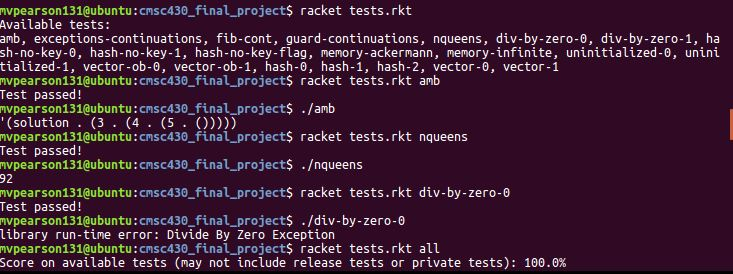

# CMSC430 Final Project

## Project Description
This project is a compiler for a subset of Scheme, written in Racket. The 
compiler takes in files with the extenstion .scm, then creates a binary after
sending the program though several compiler passes: top-level pattern matching, 
desugaring, assignment-conversion, alphatization, administrative normal 
form-conversion, continuation-passing style conversion, closure-conversion and 
finally llvm-emission. 

The first of those passes, top-level pattern matching, makes implicit begin
forms explicit, quotes all datums, desugars defines in begin forms into letrec\*
forms, and desugars quasiquotes and unquotes. 

The second pass, desugaring, takes the rich language and compiles it down into
a small language consisting of let forms, lambda calculus, conditionals, set!,
call/cc, and explicit primitive-operation forms. 

The next pass, assignment-conversion, removes set! from the language by boxing
all mutable local variables. The program then runs through
alphatization, which makes all names unique to a single binding point, removing
any shadowing of variables. 

In administrative normal form-conversion, we enforce an explicit evaluation
order of subexpressions by administratively let-binding them to temporary
variables. Let forms with multiple bindings are also flattened into multiple let
bindings. 

Next, in continuation-passing style conversion, the code is converted to
continuation-passing style. Now, a continuation is explicitly passed and no function
call ever returns. We now can remove call/cc from the language as well. 

In the closure-conversion pass, lambda abstractions are removed and replaced
with make-closure and env-ref forms. Applications are also transfored with
closure-application forms. Procedures are then lifted to the top level as well. 

After closure conversion, the final pass of the compiler is llvm emission. At
this stage, the code is turned into llvm assembly. The assembly makes use of
functions defined in header.cpp in order to allocate memory and perform
primative operations. Once the llvm code is emitted, it is compiled to a binary
using clang 3.9.

## Usage

tests.rkt is the interface through which you can compile code. It makes use of
the files top-level.rkt, desugar.rkt, cps.rkt, closure-convert.rkt, utils.rkt,
header.cpp and uthash.h.

It is designed to compile programs that are located according to a specified
directory structure. The top-level directory tests/ contains three
subdirectories, public/, release/, and secret/. All programs to compile must
exist in one of those three subdirectories. The programs must have the ".scm"
extension to be recognized by the compiler.  

You can see all available tests by running:

    racket tests.rkt 

To run all the tests, you can run:

    racket tests.rkt all

To run a specific test, you can run:

    racket tests.rkt <testname>

In the last two cases when tests are run, it will compile the program down to a
binary. Next, it runs the binary and compares the output of the program to the
output of running the program through a scheme interpreter. After running the
test, you still have access to the binary. If the name of the compiled program
was "example.scm", a binary in your current directory will be created called
"example."

Below is an image showing the usage of tests.rkt:

## Accepted Grammar

The following is the grammar that the compiler supports:

e ::= (define x e)  
	| (define (x x ... defaultparam ...) e ...+)  
	| (define (x x ... . x) e ...+)  
	| (letrec* ([x e] ...) e ...+)  
	| (letrec ([x e] ...) e ...+)  
	| (let* ([x e] ...) e ...+)  
	| (let ([x e] ...) e ...+)  
	| (let x ([x e] ...) e ...+)  
	| (lambda (x ... defaultparam ...) e ...+)	
	| (lambda x e ...+)  
	| (lambda (x ...+ . x) e ...+)  
	| (dynamic-wind e e e)  
	| (guard (x cond-clause ...) e ...+)  
	| (raise e)  
	| (delay e)  
	| (force e)  
	| (and e ...)  
	| (or e ...)  
	| (match e match-clause ...)  
	| (cond cond-clause ...)  
	| (case e case-clause ...)  
	| (if e e e)  
	| (when e e ...+)  
	| (unless e e ...+)  
	| (set! x e)  
	| (begin e ...+)  
	| (call/cc e)  
	| (apply e e)  
	| (e e ...)  
	| x  
	| op  
	| (quasiquote qq)  
	| (quote dat)  
	| nat | string | #t | #f
  
cond-clause ::= (e) | (e e e ...) | (else e e ...)  
case-clause ::= ((dat ...) e e ...) | (else e e ...)  
match-clause ::= (pat e e ...) | (else e e ...)  
in all cases, else clauses must come last  
dat is a datum   
x is a variable   
defaultparam ::= (x e)  
op is a symbol representing one of the primitive operation supported  
qq ::= e | dat | (unquote qq) | (unquote e) | (quasiquote qq)  
	| (qq ...+) | (qq ...+ . qq)  
pat ::= nat | string | #t | #f | (quote dat) | x | (? e pat) | (cons pat pat) |(quasiquote qqpat)  
qqpat ::= e | dat | (unquote qqpat) | (unquote pat) | (quasiquote qq)  
	| (qq ...+) | (qq ...+ . qq)

## Standard Primitive Operations Supported

(= *x* *y*) : Int ->  Int -> Boolean  
Returns #t if the arguments are numerically equal, #f otherwise.

(> *x* *vs* ...) : Int -> Int... -> Boolean  
Returns #t if the arguments are given in an order strictly decreasing, #f
otherwise. 

(< *x* *vs* ...) : Int -> Int... -> Boolean  
Returns #t if the arguments are given in an order strictly increasing, #f
otherwise. 

(<= *x* *vs* ...) : Int -> Int... -> Boolean  
Returns #t if the arguments are given in an order non-decreasing, #f otherwise. 

(>= *x* *vs* ...): Int , Int... -> Boolean  
Returns #t if the arguments are given in an order non-increasing, #f othersise. 

(\+ *vs* ...) : Int... -> Int  
Returns the sum of *vs*, 0 if no arguments are provided. 

(\- *x* *vs* ...) : Int -> Int... -> Int  
Returns the result of subtracting from *x*, each of the
*vs*. 

(\* *vs* ...) : Int... -> Int  
Returns the product of the *vs*, multiplied in order. If there are no
arguments, 1 is returned. 

(/ *x* *vs* ...) : Int , Int... -> Int  
Returns the result of dividing *x* by each of the *vs* in order.
Throws "library run-time error: Divide By Zero Exception" if one of the
subsequent integers is 0. 

(null? *p*) : Any -> boolean  
Returns #t if *p* is the the empty list, #f otherwise.

(car *p*) : Pair -> Any  
Returns the first element of Pair *p*.

(cdr *p*) : Pair -> Any  
Returns the second element of Pair *p*.

(cons *x* *y*) : Any -> Any -> Pair  
Returns a new Pair with the fist element being *x* and the
second element being *y*. 

(vector *vs* ...) : Any ... -> Vector  
Returns a new mutable vector, with as many slots as provided *vs*, where the slots
are initialized to contain the *vs* in order. 

(make-vector *s* [*v*]) : Int -> Any -> Vector  
Returns a new mutable vector with *s* slots. If *v* is provided, all the slots are
initialize to *v*, otherwise they are initialized to 0. 

(vector-ref *v* *p*) : Vector -> Int -> Any  
Returns the element in slot *p* of Vector *v*. The first slot is position 0 and the
last slot is one less than the total number of slots. 
If *p* is not a valid slot number of *v*, "library run-time error: Vector-ref: Index 
Out of bounds" is thrown. 

(vector-set! *v* *p* *x*) : Vector -> Int -> Any -> Void  
Mutably changes the vector by setting the value of the slot at
position *p* in Vector *v* to the value *x*. If *p* is not a valid slot number of *v*, 
"library run-time error: Vector-ref: Index 
Out of bounds" is thrown.

## Additional Primative Operations Supported

### Mutable Hash tables

(make-hash [*l*]) : [List of Pairs of Any] -> Hash  
Returns a hash table initialized based on the contents of *l*. For each
element of *l*, an entry is put into the table where the car of the element
is the key and the cdr of the element is the corresponding value. If no *l* is
provided, then an empty hash is returned.

(hash-ref *h* *k* [*f*]) : Hash -> Any -> [Any] -> Any  
Returns the value associated with key *k* in the Hash *h*. If the key is not in the
hash and an *f* is not provided, "library run-time error: Key is 
not found in the hash" is thrown. If the key is not in
the hash and an *f* is provided, *f* is returned. 

(hash-set! *h* *k* *v*) : Hash -> Any -> Any -> Void  
Mutably changes the hash by creating or replacing an entry in the Hash *h*, where
*k* is the new key and *v* is the new value. 

(hash? *h*) : Any -> Boolean  
Returns #t if *h* is a Hash, #f otherwise.

(hash-hash-key? *h* *k*) : Hash -> Any -> Boolean  
Returns #t if *k* is a key in Hash *h*, #f otherwise. 

(hash-remove! *h* *k*) : Hash -> Any -> Void  
Removes any existing mapping for *k* in *h*.

(hash-clear! *h*) : Hash -> Void  
Removes all mappings from *h*.

(hash-keys-subset? *h1* *h2*) : Hash -> Hash -> Boolean  
Returns #t if the keys of *h1* are a subset of or the same as the keys of *h2*. 

(hash-count *h*) : Hash -> Int  
Returns the number of keys mapped by *h*.

## Runtime Errors
Exception handling for the following run-time errors are added in at
compile-time. 

1. Division By Zero: A runtime error is thrown if attempting to divide by zero.
   The error is "library run-time error: Divide By Zero Exception." The relevant 
tests are located in tests/release/ they are div-by-zero-0.scm
and div-by-zero-1.scm
2. Memory Cap: A memory cap of 256MB is in place. If that limit is exceeded, an
   error is thrown. The error is "library run-time error: Ran out of memory. 
Memory cap is 256MB." The relevant tests are located in tests/release/ they are  
memory-ackermann.scm and memory-infinite.scm
3. Unbound Variables: If a variable is attempted to be accessed before it is
   bound to a value, an error is thrown. The error is "library run-time error:
Uninitialized Variable." The relevant tests are located in tests/release/ they are 
uninitialized-0.scm and uninitialized-1.scm
4. Vector Boundries: If in a call to vector-set! or vector-ref, the index is not
   in the bounds of the specified vector, an error is thrown. The error is 
"library run-time error: Vector-ref: Index Out of bounds." The relevant tests
are located in tests/release/ they are vector-ob-0.scm and vector-ob-1.scm
5. Existing Hash Keys: If in a call to hash-ref, the given key is not in the
   hash, an error may be thrown. The error is "library run-time error: Key is 
not found in the hash." An optional parameter to hash-ref can be given.
If this optional parameter is given and the key is not found, the flag is
returned to allow the programmer to handle the missing key. If the flag is not
given and the key is not found, the error is thrown. The relevant tests are 
located in tests/release/ they are  
hash-no-key-0.scm, hash-no-key-1.scm and 
hash-no-key-flag.scm

When the testing suite encounters a test that fails, the function
racket-compile-eval will return the symbol 'failure at which point the test 
will be counted as automatically passing. In order to for the memory cap tests
to terminate, a 120 second limit was put on calls to racket-compile-eval. 
To see the behavior of the binary, simply run the binary after the test passes.  

Some classes of runtime errors that are not handled by the compiler are:

1. Functions being provided too few/many arguments
2. Primitive operations being provided too few/many arguments
3. Non-Function values being applied

It is left to the programmer to ensure that these kinds of errors do not exist
in their code. 

## Garbage Collection
The compiler does not support garbage collection. 

#### Honor Pledge
I, Michael Pearson, pledge on my honor that I have not given or received any
unauthorized assistance on this assignment.
